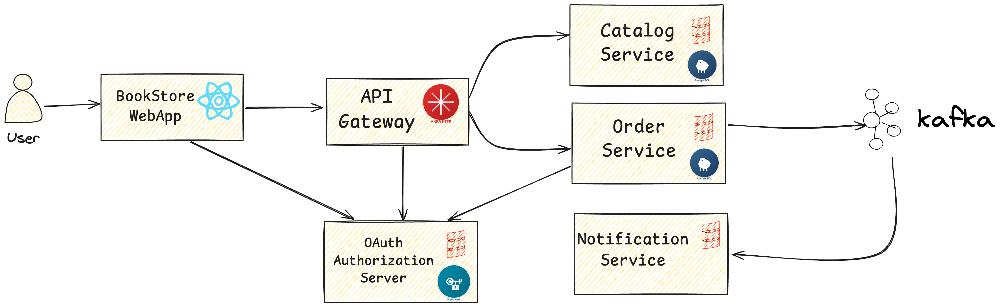

# Curso de Microservicios Scala - Aplicación BookStore

Este repositorio contiene una **aplicación BookStore** construida con **Scala, Akka HTTP y Docker**, demostrando patrones modernos de arquitectura de microservicios.



## 🏗️ Arquitectura Actual (Fase 1)

```
┌─────────────┐
│   Cliente   │
│  (Postman)  │
└──────┬──────┘
       │
       │ HTTP
       ▼
┌─────────────────────────┐
│   Catalog Service       │
│   (Akka HTTP + Quill)   │
│   Puerto: 8081          │
└───────────┬─────────────┘
            │
            │ JDBC
            ▼
    ┌───────────────┐
    │  PostgreSQL   │
    │  Puerto: 15432│
    └───────────────┘
```

## 🎯 Hoja de Ruta - Arquitectura Futura (Fases Siguientes)

```
┌──────────────┐
│  BookStore   │──┐
│   WebApp     │  │
│ (Play/Scala) │  │
└──────────────┘  │
                  │
         ┌────────┴────────┐
         │   API Gateway   │
         │ (Akka HTTP)     │
         └────────┬────────┘
                  │
    ┏━━━━━━━━━━━━━┻━━━━━━━━━━━━━━┓
    ▼             ▼              ▼
┌─────────┐  ┌─────────┐  ┌──────────────┐
│ Catalog │  │  Order  │  │Notification  │
│ Service │  │ Service │  │  Service     │
└────┬────┘  └────┬────┘  └──────▲───────┘
     │            │              │
     ▼            ▼              │
┌─────────┐  ┌─────────┐         │
│Postgres │  │Postgres │    ┌────┴──────┐
└─────────┘  └───┴─────┘    │  Kafka    │
                 │          │           │
                 └──────────┤           │
                            └───────────┘
        ┌──────────────┐
        │   Keycloak   │
        │   (OAuth2)   │
        └──────────────┘
```

## 📦 Módulos

### ✅ Fase 1 - Completada

#### **catalog-service** (ACTIVO)

Proporciona una API REST para gestionar el catálogo de productos (libros).

**Stack Tecnológico:**
- Scala 2.13
- Akka HTTP 10.5.0
- Akka Streams 2.8.0
- Quill 4.6.0 (DSL de consultas con compilación en tiempo de compilación)
- PostgreSQL 42.6.0
- Flyway 9.16.0 (Migraciones de base de datos)
- Circe 0.14.5 (Serialización JSON)
- HikariCP 5.0.1 (Pool de conexiones)
- PureConfig 0.17.4 (Gestión de configuración)
- Testcontainers (Pruebas de integración)

**Características:**
- ✅ API REST para catálogo de productos
- ✅ Soporte de paginación
- ✅ Migraciones de base de datos con Flyway
- ✅ Consultas de base de datos type-safe con Quill
- ✅ Serialización JSON con Circe
- ✅ Gestión de configuración con PureConfig
- ✅ Soporte Docker

### 🚧 Fase 2 - Próximamente

#### **order-service** (PLANIFICADO)

API REST para gestionar pedidos y publicar eventos de pedidos.

**Stack Tecnológico Planificado:**
- Scala 2.13
- Akka HTTP
- Akka Streams
- PostgreSQL
- Kafka

#### **notification-service** (PLANIFICADO)

Escucha eventos de pedidos y envía notificaciones a los usuarios.

**Stack Tecnológico Planificado:**
- Scala 2.13
- Akka Streams
- Kafka
- Integración de email

#### **api-gateway** (PLANIFICADO)

API Gateway para enrutar solicitudes a los servicios backend.

**Stack Tecnológico Planificado:**
- Scala 2.13
- Akka HTTP
- Akka Streams
- Patrón Circuit Breaker

#### **bookstore-webapp** (PLANIFICADO)

Aplicación web orientada al cliente para navegar y ordenar libros.

**Stack Tecnológico Planificado:**
- Scala 2.13
- Play Framework o Thymeleaf
- Alpine.js
- Bootstrap

## 🎓 Objetivos de Aprendizaje

- ✅ Construcción de APIs REST con Akka HTTP
- ✅ Persistencia de base de datos usando Quill y PostgreSQL
- ✅ Migraciones de base de datos con Flyway
- ✅ Programación funcional con Scala
- ✅ Configuración type-safe con PureConfig
- ✅ Serialización JSON con Circe
- ✅ Pool de conexiones con HikariCP
- ✅ Contenerización con Docker y Docker Compose
- ✅ Automatización de tareas con Taskfile
- 🚧 Arquitectura orientada a eventos con Kafka (próximamente)
- 🚧 Patrón API Gateway (próximamente)
- 🚧 Seguridad OAuth2 con Keycloak (próximamente)
- 🚧 Pruebas con ScalaTest y Testcontainers (próximamente)
- 🚧 Monitoreo y Observabilidad con Prometheus, Grafana (próximamente)

## 🛠️ Configuración del Entorno de Desarrollo Local

### Requisitos Previos

Instala las siguientes herramientas:

| Herramienta | Propósito | Instalación |
|-------------|-----------|-------------|
| **Java 11+** | Entorno de ejecución | `sdk install java 17.0.8-tem` |
| **SBT** | Scala Build Tool | `sdk install sbt` |
| **Docker Desktop** | Runtime de contenedores | [Descargar](https://www.docker.com/products/docker-desktop/) |
| **IntelliJ IDEA** | IDE con plugin de Scala | [Descargar](https://www.jetbrains.com/idea) |
| **Taskfile** | Automatización de tareas | `brew install go-task` |
| **Postman** | Pruebas de API REST | [Descargar](https://www.postman.com/) |

### Pasos de Instalación

#### 1. Instalar SDKMAN (Gestión de Java y SBT)

```bash
# Instalar SDKMAN
curl -s "https://get.sdkman.io" | bash
source "$HOME/.sdkman/bin/sdkman-init.sh"

# Instalar Java 17
sdk install java 17.0.8-tem

# Instalar SBT
sdk install sbt
```

#### 2. Instalar Taskfile

**macOS:**
```bash
brew install go-task
```

**Linux:**
```bash
sh -c "$(curl --location https://taskfile.dev/install.sh)" -- -d -b /usr/local/bin
```

**Windows:**
```bash
choco install go-task
```

#### 3. Instalar Docker Desktop

Descarga e instala desde: https://www.docker.com/products/docker-desktop/

### Verificar la Instalación

```bash
java -version      # Debería mostrar Java 11+
sbt --version      # Debería mostrar SBT 1.x
docker --version   # Debería mostrar Docker 20+
docker compose version
task --version     # Debería mostrar Task 3.x
```

## 🚀 Cómo Ejecutar la Aplicación

### Paso 1: Clonar el Repositorio

```bash
git clone https://github.com/geovannymcode/bookstore-scala
cd bookstore-scala
```

### Paso 2: Iniciar la Infraestructura

Inicia PostgreSQL y otros servicios de infraestructura:

```bash
task start_infra
```

Este comando inicia:
- 🐘 **PostgreSQL** en el puerto `15432`
- 📊 Base de datos: `postgres`
- 👤 Usuario/Contraseña: `postgres/postgres`

Espera ~10 segundos para que los servicios estén listos.

### Paso 3: Ejecutar Catalog Service

**Opción A: Ejecutar desde IntelliJ IDEA (Recomendado para desarrollo)**

1. Abre el proyecto en IntelliJ IDEA
2. Navega a `catalog-service/src/main/scala/com/bookstore/catalog/CatalogServiceApp.scala`
3. Haz clic derecho y selecciona **"Run 'CatalogServiceApp'"**
4. El servicio se iniciará en `http://localhost:8081`

**Opción B: Ejecutar con Taskfile**

```bash
task run-catalog
```

**Opción C: Ejecutar con SBT directamente**

```bash
sbt "catalogService/run"
```

### Paso 4: Verificar el Servicio

```bash
# Verificar salud del servicio
task health

# O probar la API manualmente
curl http://localhost:8081/api/products?page=1
```

## 📊 Servicios de Infraestructura

### Base de Datos PostgreSQL

**Base de Datos del Catalog Service:**
- **URL:** `jdbc:postgresql://localhost:15432/postgres`
- **Usuario:** `postgres`
- **Contraseña:** `postgres`
- **Base de datos:** `postgres`
- **Contenedor:** `catalog-db`

**Conectar vía psql:**

```bash
# Acceder al CLI de PostgreSQL
docker exec -it catalog-db psql -U postgres -d postgres

# Ver todos los productos
SELECT * FROM products;

# Contar productos
SELECT COUNT(*) FROM products;

# Salir
\q
```

**Esquema de Base de Datos:**

```sql
CREATE TABLE products (
    id          BIGINT PRIMARY KEY DEFAULT nextval('product_id_seq'),
    code        TEXT NOT NULL UNIQUE,
    name        TEXT NOT NULL,
    description TEXT,
    image_url   TEXT,
    price       NUMERIC NOT NULL
);
```

## 🧪 Probando la API

### Usando cURL

**Obtener todos los productos (página 1):**
```bash
curl http://localhost:8081/api/products?page=1
```

**Obtener todos los productos (página 2):**
```bash
curl http://localhost:8081/api/products?page=2
```

**Obtener producto por código:**
```bash
curl http://localhost:8081/api/products/P100
```

**Obtener producto inexistente (404):**
```bash
curl http://localhost:8081/api/products/INVALID
```

### Usando Postman

1. Crea una nueva Colección: **"Bookstore - Catalog Service"**
2. Agrega las siguientes solicitudes:

**Solicitud 1: Obtener Todos los Productos**
- Método: `GET`
- URL: `http://localhost:8081/api/products?page=1`

**Solicitud 2: Obtener Producto por Código**
- Método: `GET`
- URL: `http://localhost:8081/api/products/P100`

**Solicitud 3: Producto No Encontrado**
- Método: `GET`
- URL: `http://localhost:8081/api/products/P999`

### Respuesta de Ejemplo

**Respuesta Exitosa - Lista de Productos:**
```json
{
  "data": [
    {
      "id": 1,
      "code": "P100",
      "name": "The Hunger Games",
      "description": "Ganar te hará famoso. Perder significa muerte segura...",
      "imageUrl": "https://images.gr-assets.com/books/1447303603l/2767052.jpg",
      "price": 34.0
    },
    {
      "id": 2,
      "code": "P101",
      "name": "To Kill a Mockingbird",
      "description": "La inolvidable novela de una infancia en un pueblo sureño...",
      "imageUrl": "https://images.gr-assets.com/books/1361975680l/2657.jpg",
      "price": 45.40
    }
  ],
  "totalElements": 15,
  "pageNumber": 1,
  "totalPages": 2,
  "isFirst": true,
  "isLast": false,
  "hasNext": true,
  "hasPrevious": false
}
```

**Respuesta de Producto No Encontrado (404):**
```
Product with code P999 not found
```

## 🔧 Tareas Disponibles

Ver todas las tareas disponibles:

```bash
task --list
```

### Gestión de Infraestructura

```bash
task start_infra      # Iniciar infraestructura (PostgreSQL, Kafka, etc.)
task stop_infra       # Detener infraestructura
task restart_infra    # Reiniciar infraestructura
task logs_infra       # Ver logs de infraestructura
task ps               # Mostrar contenedores en ejecución
```

### Desarrollo

```bash
task run-catalog      # Ejecutar catalog-service localmente
task run-order        # Ejecutar order-service localmente (próximamente)
task run-notification # Ejecutar notification-service localmente (próximamente)
```

### Pruebas

```bash
task test             # Ejecutar todas las pruebas
task test-catalog     # Ejecutar solo pruebas de catalog-service
task test-order       # Ejecutar solo pruebas de order-service
```

### Build y Empaquetado

```bash
task compile          # Compilar todos los proyectos
task clean            # Limpiar artefactos de compilación
task package          # Empaquetar todos los servicios
task build            # Construir imágenes Docker para todos los servicios
```

### Calidad de Código

```bash
task format           # Formatear código con scalafmt
task format-check     # Verificar si el código está formateado correctamente
```

### Monitoreo

```bash
task health           # Verificar salud del servicio
task logs             # Ver logs de la aplicación
```

### Limpieza

```bash
task clean-all        # Limpiar todo (build + Docker)
```

## 📝 Documentación de la API

### API del Catalog Service

**URL Base:** `http://localhost:8081`

#### Endpoints

##### 1. Obtener Productos (Paginados)

Recupera una lista paginada de productos.

```http
GET /api/products?page={numeroDePagina}
```

**Parámetros de Consulta:**
- `page` (opcional, por defecto: 1): Número de página a recuperar

**Respuesta:** `200 OK`
```json
{
  "data": [...],
  "totalElements": 15,
  "pageNumber": 1,
  "totalPages": 2,
  "isFirst": true,
  "isLast": false,
  "hasNext": true,
  "hasPrevious": false
}
```

##### 2. Obtener Producto por Código

Recupera un solo producto por su código.

```http
GET /api/products/{codigo}
```

**Parámetros de Ruta:**
- `codigo` (requerido): Código del producto (ej: P100)

**Respuesta:** `200 OK`
```json
{
  "id": 1,
  "code": "P100",
  "name": "The Hunger Games",
  "description": "...",
  "imageUrl": "...",
  "price": 34.0
}
```

**Respuesta de Error:** `404 Not Found`
```
Product with code {codigo} not found
```

## 📁 Estructura del Proyecto

```
bookstore/
├── common/                      # Utilidades y modelos compartidos
├── catalog-service/            # Microservicio de catálogo
│   ├── src/
│   │   ├── main/
│   │   │   ├── scala/
│   │   │   │   └── com/bookstore/catalog/
│   │   │   │       ├── config/           # Configuración
│   │   │   │       ├── domain/           # Modelos de dominio y repositorios
│   │   │   │       ├── web/              # Rutas de API
│   │   │   │       └── CatalogServiceApp.scala
│   │   │   └── resources/
│   │   │       ├── application.conf      # Configuración de la app
│   │   │       └── db/migration/         # Migraciones de Flyway
│   │   └── test/
│   └── target/
├── order-service/              # Microservicio de pedidos (próximamente)
├── notification-service/       # Microservicio de notificaciones (próximamente)
├── deployment/
│   └── docker-compose/
│       └── infra.yml           # Servicios de infraestructura
├── docs/                       # Documentación y diagramas
├── project/                    # Configuración de SBT
├── build.sbt                   # Definición de build
├── Taskfile.yml               # Automatización de tareas
├── .scalafmt.conf             # Reglas de formateo de código
└── README.md                  # Este archivo
```

## 🔒 Configuración

La configuración se gestiona usando **PureConfig** y **Typesafe Config**.

### Configuración de la Aplicación

Edita `catalog-service/src/main/resources/application.conf`:

```hocon
catalog {
  name = "catalog-service"
  page-size = 10
}

database {
  url = "jdbc:postgresql://localhost:15432/postgres"
  username = "postgres"
  password = "postgres"
  driver = "org.postgresql.Driver"
  
  pool {
    minimum-idle = 5
    maximum-pool-size = 20
    connection-timeout = 30000
    idle-timeout = 600000
    max-lifetime = 1800000
  }
}

http {
  host = "0.0.0.0"
  port = 8081
  termination-deadline = 10s
}
```

### Variables de Entorno

Sobrescribe la configuración usando variables de entorno:

```bash
# Base de datos
export DB_URL="jdbc:postgresql://localhost:15432/postgres"
export DB_USERNAME="postgres"
export DB_PASSWORD="postgres"

# Servidor HTTP
export HTTP_HOST="0.0.0.0"
export HTTP_PORT="8081"

# Catálogo
export CATALOG_PAGE_SIZE="20"
```

## 🐳 Soporte Docker

### Construir Imágenes Docker (Próximamente)

```bash
# Construir todas las imágenes de servicios
task build

# Construir solo la imagen de catalog-service
task build-catalog
```

### Ejecutar con Docker Compose (Próximamente)

```bash
# Iniciar todo
task start

# Detener todo
task stop

# Reiniciar todo
task restart
```

## 🧪 Pruebas (Próximamente)

```bash
# Ejecutar todas las pruebas
task test

# Ejecutar solo pruebas de catalog-service
task test-catalog

# Ejecutar pruebas con cobertura
sbt coverage test coverageReport
```

## 📊 Monitoreo y Observabilidad (Próximamente)

Integración futura con:
- **Prometheus** - Recolección de métricas
- **Grafana** - Visualización de métricas
- **Loki** - Agregación de logs
- **Tempo** - Trazado distribuido

## 📄 Licencia

Este proyecto está licenciado bajo la Licencia MIT - consulta el archivo LICENSE para más detalles.

## 👨‍💻 Autor

Tu Nombre - [@geovannycode](https://twitter.com/geovannycode)

## 🙏 Agradecimientos

- Inspirado por [@Siva](https://twitter.com/sivalabs) en el [Curso de Microservicios con Spring Boot](https://www.youtube.com/playlist?list=PLuNxlOYbv61g_ytin-wgkecfWDKVCEDmB)
- Construido con ❤️ usando Scala y Akka

## 📚 Recursos

- [Documentación de Akka HTTP](https://doc.akka.io/docs/akka-http/current/)
- [Documentación de Quill](https://getquill.io/)
- [Documentación de Scala](https://docs.scala-lang.org/)
- [Documentación de Docker](https://docs.docker.com/)
- [Documentación de SBT](https://www.scala-sbt.org/documentation.html)

---

**⭐ ¡Dale estrella a este repositorio si te resulta útil!**
